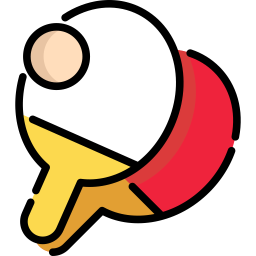
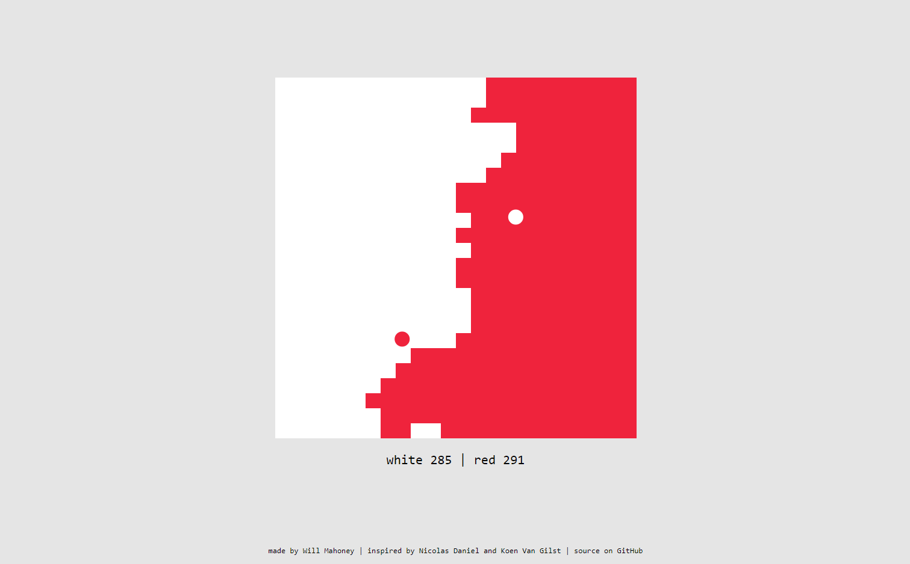

<!-- Title Container -->

  <!-- Logo -->
  

  <!-- Title -->
  <h1 style="margin-top: 10px">Pong Wars</h1>

  <!-- Subtitle -->
  
A simple little visual based on the classic game "pong" built with Vanilla JavaScript, HTML, and CSS.

<!-- Main Content -->

<!-- Image -->

## Inspiration

<!-- Text Paragraph -->
This app is inspired by Nicolas Daniel and Koen Van Gilst.

<!-- Grid for Color Scheme -->
### Color Scheme
| Color Name | Hex Code |
|------------|----------|
| Red        | #EF233C  |
| Grey       | #E5E5E5  |
| White      | #FFFFFF  |
| Black      | #000000  |

<!-- Feel free to add more sections or customize the content according to your needs -->